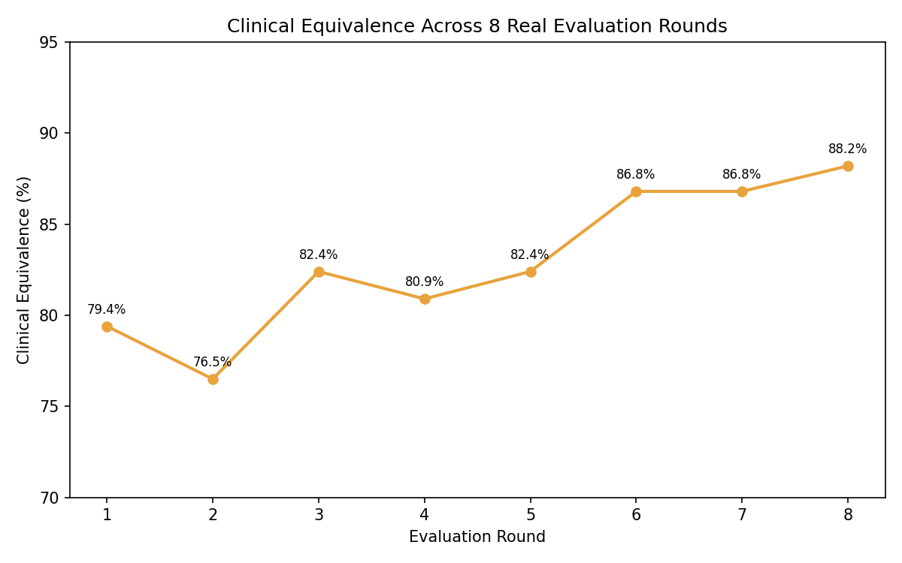
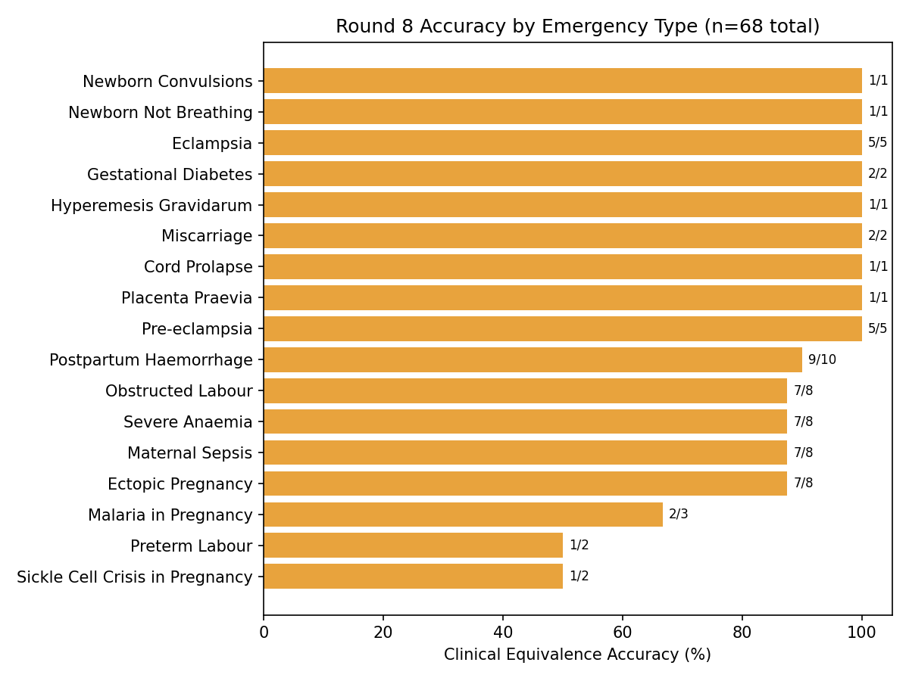
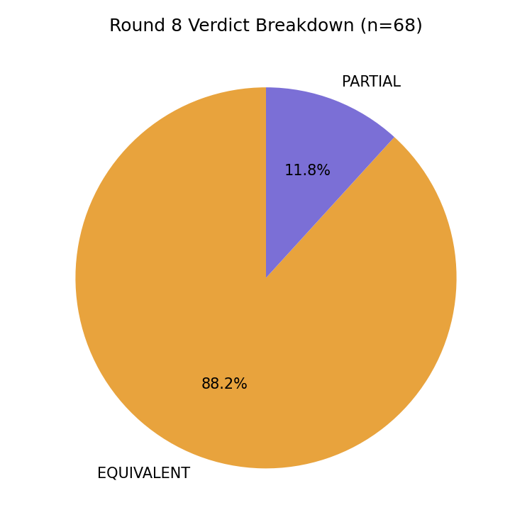

# WEMA — Women's Emergency Medical AI

A **voice-first emergency assistant for pregnant women in Nigeria**. WEMA answers a phone call from **any basic mobile phone — no smartphone or internet needed** — recognises the maternal emergency, guides the caller through **safe physical home actions**, and **alerts the nearest health facility by SMS at the same time**.

WEMA is grounded in the **Three Delays Model** of maternal mortality (Thaddeus & Maine, 1994). It targets the delay in *deciding* to seek care (instant triage), and the delays in *reaching* and *receiving* care (provider alert + urgent transport).

**Live app:** https://wema-women-s-emergency-medical-ai.fly.dev/health
**Demo video:** https://drive.google.com/file/d/1oj7KgQUYuWaTDzjo0erQvY-Dt-yd6aEg/view?usp=sharing
[](https://github.com/Pam-Pam29/WEMA-Women-s-Emergency-Medical-AI/actions/workflows/tests.yml)

---

## What WEMA Does

1. **Caller dials** the WEMA hotline from any phone.
2. **Speech-to-text** transcribes the caller's words (Nigerian-English tuned).
3. **Retrieval** pulls the most relevant passages from a curated clinical knowledge base.
4. **Generation** returns a short, calm, **physical-only** response using the dual-path prompt.
5. **Text-to-speech** speaks the guidance back to the caller.
6. **SMS alert** notifies the nearest health facility **in parallel**.

---

## The Dual-Path Design (core safety principle & custom logic)

WEMA gives a home action **only when one genuinely exists** — this routing is the project's key custom algorithm:

- **Path A — a safe home action helps.** WEMA delivers the specific physical step — e.g. postpartum haemorrhage → uterine massage + put baby to breast; eclampsia → left-side positioning; cord prolapse → knee-chest position — then urges transport.
- **Path B — no safe home action exists** (e.g. suspected ectopic pregnancy, placenta praevia). WEMA does **not** invent a remedy. It routes the caller to immediate transport — *go now, not wait* — while help is alerted, adding only harm-avoidance ("do not press the abdomen").

All guidance is **physical-only**: WEMA never names drugs, prescriptions, or clinical procedures, because the caller is at home without equipment or medication. Provider selection is **implemented and unit-tested** as a Haversine great-circle nearest-facility ranking (`src/sms.py`), but a plain PSTN voice call has no mechanism to supply GPS coordinates, so this ranking is not yet exercised on a live call — routing currently falls through to a caller-state match, then a default. See Honest Limitations below.

---

## Architecture


| Stage | Component |
|---|---|
| Speech-to-text | Deepgram Nova-2 (en-NG) |
| Embedding | sentence-transformers `all-MiniLM-L6-v2` (384-dim) |
| Vector store | ChromaDB (collection `wema_maternal_health`) |
| Generation | Qwen3.6-27B via Groq (temperature 0.2) |
| Text-to-speech | Azure Neural TTS (en-NG) |
| Alerting | Twilio SMS (state-matched; Haversine ranking implemented, not yet wired to live GPS) |
| Voice orchestration | Flask webhook |

**Knowledge base:** 19 curated WHO / ACOG / national clinical guidelines plus a clinician-reviewed action protocol document, indexed as **10,059 retrievable passages** in ChromaDB.

**Code organisation:** the system is modular by responsibility — `app.py` (voice orchestration), `rag.py` (retrieval + dual-path generation), `sms.py` (alerting), `prompt.py` (fallbacks/intents), `ingest.py` (knowledge-base build) — so each stage of the pipeline is independently testable.

**Why functional style, not OOP:** each module is a stateless request/response transform (transcript in → guidance out; alert request in → SMS fan-out out), and Flask route handlers are functions by design — wrapping them in classes would add ceremony without adding behaviour. The one piece of real shared *state* — per-call session data (`call_sessions`, `response_ready` in `app.py`; `CASES` in `sms.py`) — is intentionally isolated behind small accessor functions (e.g. `get_session()`) rather than scattered inline, which is the concern a class would otherwise exist to encapsulate. This is a deliberate trade-off for a single-worker webhook service, not an oversight.

---

## Data Engineering

WEMA rests on two labelled data assets:

1. **Clinical knowledge base** — 19 source documents plus one authored clinician-reviewed protocol document → **10,059 chunks**. Retrieval is grounded in these passages so the model never answers from memory alone.
2. **Evaluation scenarios** — **68 labelled test cases across 17 emergency types**. Each has a caller script, the expected home action, a risk level, and an alerting decision. **Clinician-reviewed** — Dr. Kolade confirmed the review and validation in writing (WhatsApp), with formal clinical sign-off in progress.

**Preprocessing pipeline:** PDF text extraction → cleaning (referral forms, citations, headers removed) → fixed-size chunking with overlap → MiniLM embeddings → ChromaDB index.

**Provider data — two files, deliberately different:**
- `data/providers.csv` — the file `src/sms.py` actually loads at runtime. During development and live demo calls it is intentionally scoped down to 2 facilities (General Hospital Alimosho, General Hospital Ikorodu), each with its own distinct test phone number kept separate from the caller's own number — so closed-loop ACCEPT/DECLINE testing can exercise two independently-responding numbers, and **real Nigerian hospitals are never SMS-spammed by test or demo calls**.
- `data/providers_production.csv` — the real dataset: 29 facilities across 11 states with real, verified facility phone numbers. This is the file to point `PROVIDERS_CSV` at for an actual production rollout, once real facility partnerships (SMS consent, on-call numbers) are confirmed.

---

## Testing Strategies

WEMA was tested with **five complementary strategies**, not a single pass — covering correctness, input variation, edge cases, failure modes, and environment:

1. **Unit tests** — SMS-trigger logic, caller-state extraction, Haversine distance/ranking, provider-directory behaviour, session isolation, fallback-response routing, and the legal/privacy pages. Runnable and CI-able with real `assert`s in [`tests/`](tests/) (`pytest tests/` — 60 passing across 5 suites), not just notebook print statements; also exercised interactively in [`evaluation/WEMA_Test_Suite_Walkthrough.ipynb`](evaluation/WEMA_Test_Suite_Walkthrough.ipynb).
2. **Hyperparameter sweep** — retrieval depth k ∈ {2, 4, 6, 8} and temperature ∈ {0.0–0.3}; **k = 4, temperature = 0.2 selected** (see the evaluation notebook's hyperparameter section).
3. **Clinical equivalence evaluation** — 68 clinician-reviewed scenarios, 17 emergency types, **English *and* Nigerian Pidgin** (12/68 Pidgin), scored by an **independent LLM judge** (see Evaluation below).
4. **Failure-handling tests** — `scripts/fallback_demo.py` injects three real failure modes into the actual production `ask_wema()` (generation outage, empty retrieval, truncated output) and confirms a safe, non-empty, medication-free response in every case (3/3 pass), mirrored at unit level in `tests/test_prompt.py` and `tests/test_rag_safety_net.py`.
5. **Cross-environment / hardware–software testing** — the voice interface is architecturally identical on a basic feature phone and a smartphone (plain PSTN call, no app/data required on the caller's end), though this specific claim is not independently instrumented — it follows from the design, not a captured feature-phone-vs-smartphone test artifact. What *is* directly measured: **local development vs Fly.io production**, where the ML stack (sentence-transformers + ChromaDB) **runs out of memory on 512 MB free tiers and runs stably on the 2 GB production machine** — the deployment configuration is itself a tested performance requirement.

---

## Evaluation

Each scenario is answered by the **actual production function** (`rag.ask_wema()` — hardcoded k=4, temperature=0.2, `qwen/qwen3.6-27b`) and scored for clinical equivalence (EQUIVALENT / PARTIAL / DIVERGENT) by an **independent LLM judge** (`llama-3.3-70b-versatile`, temperature 0) — a separate model from the one being tested, to avoid self-grading bias. The judge compares **clinical intent, not wording**. Full results, per-scenario responses, the RAG Triad evaluation, the full round-by-round iteration history, and a data-validation pass over the knowledge base/provider directory/evaluation dataset are in [`evaluation/WEMA_Testing_and_Evaluation.ipynb`](evaluation/WEMA_Testing_and_Evaluation.ipynb). Earlier evaluation runs (an earlier Llama-70B architecture, and an exploratory Qwen3-32B run) are preserved as an authentic record in [`evaluation/history/`](evaluation/history/).

**Final results (all 68 clinician-reviewed scenarios, real Groq API calls against the current production model and knowledge base):**

| Metric | Result |
|---|---|
| **Clinical Equivalence** | **88.2% (60/68)** |
| **Physical-Only Safety** | **100% (68/68)** |
| SMS Trigger Rate | 97.1% (66/68) |
| True Divergence | 0% (0/68) |
| Mean Judge Score | 4.79 / 5 |
| Mean Latency (LLM generation calls only, n=56) | 7.04s mean, 6.67s median (range 4.7–18.1s) |





---

## Analysis of Results

**Proposal objectives vs measured outcome:**

| Proposal target | Measured result | Status |
|---|---|---|
| ≥ 80% WHO IMPAC adherence | **88.2% clinical equivalence** | **Exceeded** |
| < 90s response latency | **~7s typical LLM generation, up to 18s in rare cases** | **Exceeded** |
| Physical-only safe guidance | **100% (0 drug recommendations)** | **Met** |
| Alert nearest facility | State-matched routing (Haversine ranking implemented, not yet live), **97.1% trigger rate** | **Met** |

**What the evaluation actually found (7 real issues):** running against the clinician-reviewed dataset surfaced **seven** genuine safety/quality issues in the SYSTEM prompt that ad hoc testing had missed:

1. Missing **retained-placenta** protocol — was defaulting to dangerous belly-massage guidance.
2. Missing **wound-bleeding** protocol — same belly-massage error.
3. Missing **hyperglycaemic gestational-diabetes** protocol.
4. **Pregnant-vs-postpartum comprehension bug** — a Pidgin ectopic-pregnancy case was misread as postpartum bleeding.
5. Missing **mastitis** protocol — was telling callers to stop breastfeeding, contrary to WHO guidance to continue/express.
6. **Response-hallucination bug** — invented a symptom the caller never mentioned.
7. **Response-truncation bug** — one scenario returned a near-empty response; fixed with a near-empty-response fallback threshold.

Each was fixed, redeployed, and re-verified with real API calls. Equivalence moved **89.7% → 86.8% → 91.2% → 94.1%** across four full re-runs under the `qwen3-32b` architecture — the **dip in round 2 is genuine LLM run-to-run variability at temperature=0.2, not a regression** (full before/after table in the evaluation notebook's Iteration History section). A second evaluation phase followed a further generation-model change (`qwen3-32b` → `qwen3.6-27b`) plus the knowledge-base and fallback-library work described above; across this phase, run against the same 68 scenarios, equivalence moved **79.4% → 76.5% → 82.4% → 80.9% → 82.4% → 86.8% → 86.8% → 88.2%**, the figure reported as final above. Two targeted SYSTEM-prompt refinements in the final round (explicit leg-elevation and immediate-transport wording for postpartum haemorrhage; explicit wound-covering and no-vaginal-insertion wording for maternal sepsis) closed the last two content gaps identified by the independent judge, bringing true divergence to 0% for this round. Full round-by-round detail for both phases is in the evaluation notebook's Iteration History section.

**No divergent case remained in the final round:** all 68 responses were judged either EQUIVALENT (60) or PARTIAL (8), and none contained harmful, fabricated, or medication-naming guidance. Each PARTIAL verdict reflected a minor, safe omission rather than dangerous advice — e.g. one postpartum-haemorrhage response omitted an explicit instruction not to push, and one maternal-sepsis response omitted covering an infected wound with a clean cloth, while still directing the caller to transport in both cases.

---

## Discussion

**Why the milestones matter.** In a life-critical domain a hallucinated instruction can kill, so **RAG grounding** against 19 clinical guidelines is not a nice-to-have — it constrains the model to verified protocol text. The **physical-only constraint** reflects the real caller: at home, with no drugs or equipment, so every instruction must be an action she can take with her hands and body. The **independent-judge** design guards against a model flattering its own output.

**The impact of the results.** The single most important outcome is not the headline number — it is that **testing against a clinician-reviewed dataset caught seven cases where WEMA would have given a real caller useless or harmful advice** (belly massage for a retained placenta, stopping breastfeeding for mastitis, an invented symptom). Catching those *before* going live is the entire argument for rigorous, dataset-driven evaluation over trusting a model's fluent output. This is what a working evaluation method looks like: across the four rounds the failures shifted from **systematic gaps** (missing protocol branches) to a single **conservative over-triage** — evidence of convergence, not a lucky score.

**Equity framing.** Because WEMA is a plain phone call, it reaches the women most at risk — those with a basic phone and no data — identically to smartphone users. The Fly.io **Johannesburg** region was chosen deliberately for the lowest latency to Nigerian callers.

---

## Recommendations

**For the community / deployment:**
- Add a **manual-review queue** for DIVERGENT/high-risk verdicts before scaling call volume.
- Keep `providers.csv` current through **facility partnerships** — routing is only as good as the underlying data.
- Move SMS to a **Nigerian-registered sender** (e.g. Termii) for reliable in-country delivery.
- Explicitly ask a caller to confirm her state or nearest town early in the call, since a plain PSTN call cannot supply GPS and a distressed caller cannot be relied on to volunteer it naturally.
- Keep a **clinician in the loop** and re-validate as WHO protocols update; WEMA augments, never replaces, skilled care.

**Already implemented (verified in production, not just planned):**
- **Closed-loop provider response** — the three nearest facilities are alerted, the first to reply ACCEPT is allocated the case, the remaining facilities are automatically notified the case has been taken, and the caller is sent a confirmation naming the responding facility (`sms.py`'s `handle_provider_reply`). Verified end-to-end against the live deployment this session: a live call dispatched an alert, and the ACCEPT/DECLINE flow correctly allocated and notified. Remaining work: validation across multiple live facilities and a durability fix, since case state currently lives in an in-memory dict that doesn't survive a process restart.

**Future work:**
- **Full Hausa, Yoruba, and Igbo support** — the top post-capstone priority, since the women most at risk are least likely to speak fluent English under stress. Evaluation exposed a real Pidgin comprehension failure, so language robustness is a concrete gap, not a nice-to-have.
- **Wire GPS-based Haversine routing into the live call path** — the ranking function is implemented and unit-tested, but `app.py` never collects or passes caller coordinates today, so real calls route by state-match only (see Honest Limitations).
- **Rigorous temperature comparison** across the full 68-scenario set (not just a single-question consistency check).
- **Multi-region deployment** if call volume outgrows a single Johannesburg machine.

**Honest limitations:**
- Temperature=0.2 shows genuine run-to-run variability — different scenarios failed on different full runs even with an unchanged prompt.
- LLM-as-judge is a **proxy, not ground truth**; correctness ultimately rests on the clinician-reviewed labelled scenarios and the physical-only constraint.
- Language coverage is English and Nigerian Pidgin only; Dr. Kolade confirmed the review and validation in writing (WhatsApp), with formal clinical sign-off still in progress.
- The secondary-PPH safety-net regex in `rag.py` (`_secondary_pph_risk`) only matches digit forms of elapsed time ("2 weeks ago"), not spelled-out numbers ("two weeks ago") — a caller phrasing it the second way would not get the extra safety-note injection. Caught by `tests/test_rag_safety_net.py`, not yet fixed.
- **Haversine-ranked facility alerting is implemented and unit-tested but not yet reachable on a real call** — `app.py` never extracts or passes caller GPS coordinates to the alerting function, so `find_nearest_providers()`'s GPS branch is dead code in production today; every real call falls through to state-name matching or the Lagos default. Confirmed directly by tracing a live call's logs this session.
- The production knowledge base lives on a persistent Fly.io volume, separate from the git-committed `knowledge_base/` folder — a code deploy alone does **not** refresh it. Confirmed directly: after deploying a knowledge-base rebuild, the live vector store still held the pre-rebuild chunk count until the volume was manually synced and the app restarted.

---

## Live Deployment

**WEMA is deployed and callable right now:**
- **Phone number:** +1 415 914 8822 (Twilio, routed to production)
- **Web/health check:** https://wema-women-s-emergency-medical-ai.fly.dev/health
- **Hosting:** Fly.io, Johannesburg region (`jnb`) — chosen for lower latency to Nigerian callers over alternatives with no African region

---

## Deployment Plan & Execution

**Status: deployed and live**, not just planned.

1. **Image build:** `Dockerfile` builds a Python 3.12 image with all system deps (audio/gstreamer libs for Twilio media), installs `requirements.txt`, and pre-downloads the MiniLM embedding model.
2. **Runtime config:** `fly.toml` — 2 GB RAM, shared CPU, Johannesburg region, persistent volume mount for the knowledge base, health checks against `/health`.
3. **Secrets:** provided as Fly.io secrets at runtime (`flyctl secrets set ...`), **never committed to git**.
4. **Deploy command:** `flyctl deploy -a wema-women-s-emergency-medical-ai` — rolling deploy with automatic health-check verification before traffic cutover.
5. **Verification:** confirmed via (a) `/health` endpoint, (b) real inbound and outbound Twilio calls exercising the full voice pipeline end-to-end, (c) the 68-scenario evaluation notebook run directly against the deployed knowledge base and SYSTEM prompt.

---

## Setup (run locally)

### Prerequisites
- Python 3.12
- API keys: Groq, Deepgram, Azure Speech, Twilio (see `.env.example` for the exact variable names)

### 1. Clone and install
```bash
git clone https://github.com/Pam-Pam29/WEMA-Women-s-Emergency-Medical-AI.git
cd WEMA-Women-s-Emergency-Medical-AI
python -m venv venv
source venv/bin/activate        # Windows: venv\Scripts\activate
pip install -r requirements.txt
```

### 2. Configure secrets
```bash
cp .env.example .env            # then fill in your own API keys
```
**Required for a local run — do not skip:** also uncomment and set `CHROMA_DB_PATH=knowledge_base` in your new `.env` file. `src/rag.py` defaults this to `/data/knowledge_base`, which is the production Fly.io volume mount path and does **not** exist on your machine. Without this line, `load_vectorstore()` will raise `RuntimeError: ... loaded with 0 chunks`, the app will silently fall back to `vectorstore=None`, and every call will get a generic fallback response with no indication that retrieval/generation never ran. This is confirmed by direct reproduction, not a hypothetical.

### 3. Knowledge base
The knowledge base is already built and committed (`knowledge_base/`, ChromaDB, **10,059 chunks** from 19 WHO/clinical guideline PDFs plus one authored protocol document). `python src/ingest.py` rebuilds it from `data/pdfs/` — but **the 19 WHO/clinical guideline PDFs themselves are not committed** (gitignored for size), so a fresh clone cannot fully rebuild this step without first placing those source PDFs in `data/pdfs/` yourself. The one authored `.md` protocol document (`data/pdfs/WEMA_Clinical_Action_Protocol.md`) *is* committed, since it's WEMA's own reference document rather than a scanned external guideline. The committed `knowledge_base/` is the only complete rebuild path a fresh clone actually has.

### 4. Run the voice layer locally
```bash
python src/app.py               # starts the Flask webhook on http://localhost:8080
```
To receive real Twilio calls locally you'll need a tunnel (e.g. ngrok) pointed at port 8080, with `APP_BASE_URL` in `.env` set to that tunnel URL, and the Twilio number's webhook pointed at `<tunnel-url>/voice/incoming`.

### 5. Run the unit tests
```bash
pip install -r requirements-dev.txt
pytest tests/
```
Runs 60 tests across 5 suites (SMS-trigger, state-extraction, Haversine distance/ranking, provider directory, session isolation, fallback-response routing, legal pages) against the real `src/sms.py`, `src/rag.py`, `src/session_store.py`, and `src/prompt.py` — no API keys or knowledge base required.

### 6. Run the evaluation notebook
Open [`evaluation/WEMA_Testing_and_Evaluation.ipynb`](evaluation/WEMA_Testing_and_Evaluation.ipynb) **from within your cloned copy of this repo** (locally in Jupyter, or by cloning the repo into your Colab/Kaggle environment first — the notebook itself does not perform a `git clone`; it assumes it is already running from inside the repo and uses relative paths like `../knowledge_base` and `../data/providers.csv`, exactly as it would in production). It additionally requires `pandas` and `matplotlib`, which are not in `requirements.txt`/`requirements-dev.txt` (they're only needed for this notebook, not the app or tests):
```bash
pip install pandas matplotlib jupyter
```
Once running, it loads the real knowledge base and re-runs the full 68-scenario evaluation against the actual production code — this requires a `GROQ_API_KEY` and will make real, metered API calls.

---

## Repository Structure

```
WEMA-Women-s-Emergency-Medical-AI/
├── README.md
├── requirements.txt
├── requirements-dev.txt        # adds pytest for running tests/
├── .env.example
├── Dockerfile                  # production image (used by Fly.io)
├── fly.toml                    # Fly.io deployment config
├── src/
│   ├── app.py                  # Flask voice webhook (Twilio + hybrid STT)
│   ├── rag.py                  # retrieval + dual-path generation (SYSTEM prompt lives here)
│   ├── sms.py                  # Haversine distance/ranking, provider alerting, closed-loop ACCEPT/DECLINE
│   ├── prompt.py                # fallback responses, conversational intents
│   ├── ingest.py                # builds the ChromaDB knowledge base from data/pdfs/
│   ├── session_store.py         # per-call in-memory session/response/audio state
│   ├── templates/legal.html     # privacy policy page (served at /privacy)
│   ├── test_call.py             # manual test: places a real outbound call to the deployed number
│   └── test_deepgram.py         # manual test: verifies Deepgram STT connectivity
├── scripts/
│   └── fallback_demo.py         # fault-injection demo: 3 failure modes, verifies fail-safe behaviour
├── tests/                      # pytest — 60 tests across 5 suites (`pytest tests/`)
├── data/
│   ├── providers.csv           # runtime provider file — demo-scoped to 2 facilities, see Data Engineering
│   ├── providers_production.csv # real 29-facility dataset (11 states), real numbers — for production rollout
│   ├── pdfs/                   # WHO/clinical guideline PDFs (not committed) + WEMA_Clinical_Action_Protocol.md (committed)
│   └── WEMA_Labeled_Dataset_final_v2.xlsx   # 68 clinician-reviewed evaluation scenarios
├── evaluation/
│   ├── WEMA_Testing_and_Evaluation.ipynb    # canonical 68-scenario evaluation (88.2%), RAG Triad, iteration history, data validation
│   ├── WEMA_Pipeline_Demo.ipynb              # architecture/pipeline walkthrough with real captured output
│   ├── WEMA_Test_Suite_Walkthrough.ipynb     # real pytest run, suite by suite
│   ├── _eval_results.json                    # raw per-scenario results backing the current headline numbers
│   └── history/                              # authentic earlier evaluation runs — see history/README.md
│       ├── README.md
│       ├── WEMA_Full_Evaluation_Colab.ipynb
│       └── WEMA_—_Qwen3_32B_on_Groq.ipynb
├── knowledge_base/             # persisted ChromaDB store (committed, 10,059 chunks)
└── archive/                     # superseded pre-final-architecture files — see archive/README.md
```

---

## Academic Context

- **Programme:** BSc Software Engineering (Machine Learning), African Leadership University
- **Framework:** Three Delays Model (Thaddeus & Maine, 1994)
- **Key references:** Xie et al. (2024); Santos et al. (2023); Okonofua et al. (2019); Togunwa et al. (2023)

---

*WEMA is a research prototype. It is not a certified medical device and must not replace professional emergency care.*
